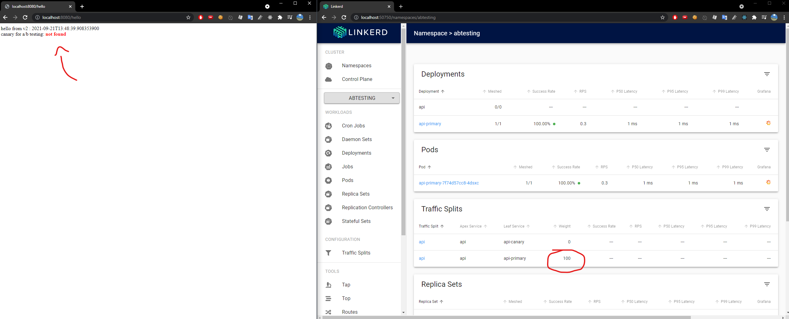
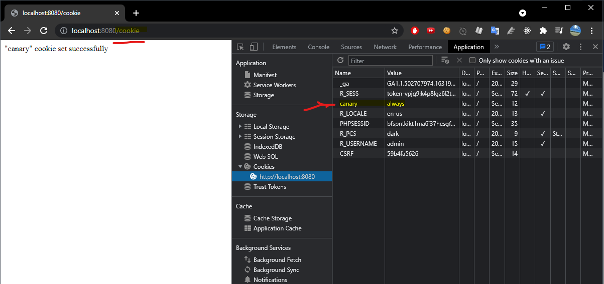

# Implantação de A/B Testing Deployment com Linkerd

Essa PoC tem como objetivo demonstrar a implantação de um sistema de deployment A/B Testing utilizando o *Service Mesh* Linkerd.

## Pré-requisitos

Possuir o Linkerd e o Viz (extensão) instalados no cluster kubernetes:

```
linkerd install | kubectl apply -f -
linkerd viz install | kubectl apply -f -
```

Instalar o Flagger:

`kubectl apply -k github.com/fluxcd/flagger//kustomize/linkerd`

Instalar o NGINX como Ingress provider:

```
helm repo add "stable" "https://charts.helm.sh/stable" --force-update
helm upgrade -i nginx-ingress stable/nginx-ingress --namespace abtesting
```

Habilitar injeção do linkerd no namespace abtesting:

`kubectl annotate namespace abtesting linkerd.io/inject=enabled`

## Descrição

A aplicação backend (/abtesting-backend) escuta na porta 8080 nos contextos:
- /hello: retorna um string informando a versão e se o cookie 'canary' está ativo (aways) ou não (not found).
- /cookie: seta o cookie 'canary' como aways
  
  Para a realização dos testes foi realizado o build de duas versões, podendo ser encontrada no docker hub:
  - tiagomac/abtesting-backend:1.0 - versão 1.0
  - tiagomac/abtesting-backend:2.0 - versão 2.0
  
O teste consiste em mudar a versão da aplicação após sua execução e identificar se o A/B Testing, identificado pelo cookie (canary) ou header (X-canary) redireciona o tráfego para a nova versão. Após a correta execução de X requisições, o deployment **canary** assume o posto do **primary**, do contrário o status fica como "failed" e não ocorre a atualização da imagem.


Realiza o direcionamento da porta para o host

`$ kubectl -n abtesting port-forward svc/api 8080:8080`


Modifica a imagem para a versão 2.0 para iniciar o processo de um novo deploy:
`$ kubectl -n abtesting set image deployment/api api=tiagomac/abtesting-backend:2.0`



Chamando o contexto /cookie setamos um cookie para identificação do canary, assim se torna possível realizar o teste A/B:



Após as configurações é preciso "injetar" as configurações do Linkerd nos nossos yamls para o provisionamento dos *sidecars* (proxies):

`$ kubectl get -n abtesting deploy -o yaml | linkerd inject - | kubectl apply -f -`

A propriedade "metrics" no descriptor do canary (*canary.yaml*) coleta as requisições com status 404:

```
    metrics:
    - name: "404s percentage"
      threshold: 3
      query: |
        100 - sum(
            rate(
                response_total{
                    namespace="test",
                    deployment="podinfo",
                    status_code!="404",
                    direction="inbound"
                }[1m]
            )
        )
        /
        sum(
            rate(
                response_total{
                    namespace="test",
                    deployment="podinfo",
                    direction="inbound"
                }[1m]
            )
        )
        * 100
```