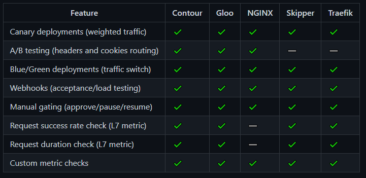

# Implantação de A/B Testing Deployment com Linkerd

Essa PoC tem como objetivo demonstrar a implantação de um sistema de deployment A/B Testing utilizando o *Service Mesh* Linkerd.

Pelo não suporte oficial do Flagger para o Linkerd, será utilizado o NGINX como Ingress, como solução para tratamento dos headers e cookies, tornando possível o teste A/B com o Linkerd e o Flagger.

Service Mesh + Flagger:


Ingress + Flagger:




## Pré-requisitos

Possuir o Linkerd e o Viz (extensão) instalados no cluster kubernetes:

```
linkerd install | kubectl apply -f -
linkerd viz install | kubectl apply -f -
```

Instalar o Flagger:

`kubectl apply -k github.com/fluxcd/flagger//kustomize/linkerd`

Instalar o NGINX como Ingress provider:

```
helm repo add ingress-nginx https://kubernetes.github.io/ingress-nginx
kubectl create ns ingress-nginx
helm upgrade -i ingress-nginx ingress-nginx/ingress-nginx \
--namespace ingress-nginx \
--set controller.metrics.enabled=true \
--set controller.podAnnotations."prometheus\.io/scrape"=true \
--set controller.podAnnotations."prometheus\.io/port"=10254
```

Instalar o Flagger e o add-on do Prometheus no mesmo namespace:

```
helm repo add flagger https://flagger.app

helm upgrade -i flagger flagger/flagger \
--namespace ingress-nginx \
--set prometheus.install=true \
--set meshProvider=nginx
```

Criar o namespace abtesting:

`kubectl apply -f k8s-yamls/namespace.yaml`

Habilitar injeção do linkerd no namespace abtesting:

`kubectl annotate namespace abtesting linkerd.io/inject=enabled`

Aplicar configurações do deployment:

`kubectl apply -f k8s-yamls/deployment.yaml`

Aplicações configurações do serviço:

`kubectl apply -f k8s-yamls/svc.yaml`

Aplicações configurações do ingress:

`kubectl apply -f k8s-yamls/ingress.yaml`

Aplicações configurações do canary:

`kubectl apply -f k8s-yamls/canary.yaml`

Configurar o arquivo 'hosts' para o endereço configurado no ingress:

`127.0.0.1 abtesting`

Modifica a imagem para a versão 2.0 para iniciar o processo de um novo deploy:

`$ kubectl -n abtesting set image deployment/api api=tiagomac/abtesting-backend:2.0`

## Descrição

A aplicação backend (/abtesting-backend) escuta na porta 8080 nos contextos:
- /hello: retorna um string informando a versão e se o cookie 'canary' está ativo (aways) ou não (not found).
- /cookie: seta o cookie 'canary' como aways
  
  Para a realização dos testes foi realizado o build de duas versões, podendo ser encontrada no docker hub:
  - tiagomac/abtesting-backend:1.0 - versão 1.0
  - tiagomac/abtesting-backend:2.0 - versão 2.0
  
O teste consiste em mudar a versão da aplicação após sua execução e identificar se o A/B Testing, identificado pelo cookie (canary) ou header (X-canary) redireciona o tráfego para a nova versão. Após a correta execução de X requisições, o deployment **canary** assume o posto do **primary**, do contrário o status fica como "failed" e não ocorre a atualização da imagem.


Chamando o contexto /cookie setamos um cookie para identificação do canary, assim se torna possível realizar o teste A/B:


Após as configurações é preciso "injetar" as configurações do Linkerd nos nossos yamls para o provisionamento dos *sidecars* (proxies):

`$ kubectl get -n abtesting deploy -o yaml | linkerd inject - | kubectl apply -f -`

A propriedade "metrics" no descriptor do canary (*canary.yaml*) coleta as requisições com status 404, nesse exemplo o status 404 está sendo considerado como um retorno de erro, mas utilizando as [metric queries](https://prometheus.io/docs/prometheus/latest/querying/examples/) do prometheus é possível atribuir casos de erro a outros cenários:

```yaml
    metrics:
    - name: "404s percentage"
      threshold: 3
      query: |
        100 - sum(
            rate(
                response_total{
                    namespace="abtesting",
                    deployment="api",
                    status_code!="404",
                    direction="inbound"
                }[1m]
            )
        )
        /
        sum(
            rate(
                response_total{
                    namespace="abtesting",
                    deployment="api",
                    direction="inbound"
                }[1m]
            )
        )
        * 100
```

## Testes

Para testes foram realizadas requisições com o propósito de obter status codes 404, com o intuito de suspender uma atualização de versão inicializada com o comando:

`kubectl -n abtesting set image deployment/api api=tiagomac/abtesting-backend:2.0`

Foi utilizado o postman como ferramenta de teste e foram disparadas requisições para um contexto inexistente:


Após foi executado o comando para descrever o status do deployment:

`kubectl -n abtesting describe canary/api`

E foi possível identificar a interrupção do deployment devido aos consecutivos status 404 recebidos:


### A/B Testing

Na fase de promoção da nova imagem, as requisições que chegam com o header 'x-canary' ou com o cookie 'canary' são direcionadas para a nova imagem (v2):


Enquanto as requisições sem esse header e cookie são direcionadas para a antiga imagem (v1):


Se após o período de análise (ou avaliação), configurado no atributo analyses do canary:

 ```yaml
 analysis:
    interval: 1m
    threshold: 10
    iterations: 10
 ```

 Nenhum erro associado ao [metric query](https://prometheus.io/docs/prometheus/latest/querying/examples/) for identificado, a nova imagem assume o deployment em definitivo:

 

 ## Alertas
 Existe também a possíbilidade de adicionar alertas para os deployments, em caso de sucesso ou falha para grupos no slack, discord ou MS Teams (testes não realizados):

 ```yaml
 # alerting (optional)
    alerts:
      - name: "dev team Slack"
        severity: error
        providerRef:
          name: dev-slack
          namespace: flagger
      - name: "qa team Discord"
        severity: warn
        providerRef:
          name: qa-discord
      - name: "on-call MS Teams"
        severity: info
        providerRef:
          name: on-call-msteams
 ```


# Referências
1. [https://chowdera.com/2021/07/20210730105127320k.html](https://chowdera.com/2021/07/20210730105127320k.html)
2. [https://docs.flagger.app/tutorials/linkerd-progressive-delivery](https://docs.flagger.app/tutorials/linkerd-progressive-delivery)
3. [https://github.com/fluxcd/flagger](https://github.com/fluxcd/flagger)
4. [https://linkerd.io/2.10/features/traffic-split/](https://linkerd.io/2.10/features/traffic-split/)